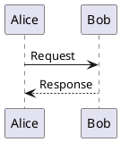
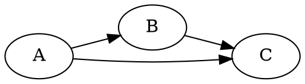

# Diagrams: PlantUML, Graphviz & Gnuplot

## Workflow

1. Write source file in `/workspace/group/`
2. Render to PNG
3. Send via `mcp__nanoclaw__send_file`

## PlantUML

### Render

```bash
plantuml -tpng diagram.puml
# produces diagram.png
```

### Example



Common diagram types: sequence, class, activity, component, state, use case, Gantt, mindmap.

## Graphviz

### Layout engines

| Engine | Best for |
|--------|----------|
| `dot`  | Directed graphs, hierarchies (default) |
| `neato` | Undirected graphs, spring model |
| `fdp`  | Undirected graphs, force-directed |
| `circo` | Circular layouts |
| `sfdp` | Large undirected graphs |

### Render

```bash
dot -Tpng graph.dot -o graph.png
# or with another engine:
neato -Tpng graph.dot -o graph.png
```

### Example



## Gnuplot

### Render

The script must set the PNG terminal and output file:

```gnuplot
set terminal pngcairo size 800,600
set output "chart.png"
set title "Example"
plot sin(x) with lines
```

```bash
gnuplot script.gp
# produces chart.png
```

## Tips

- All source files go in `/workspace/group/`
- Always render to PNG before sending
- Use descriptive filenames (e.g., `architecture.puml`, `dependency-graph.dot`)
